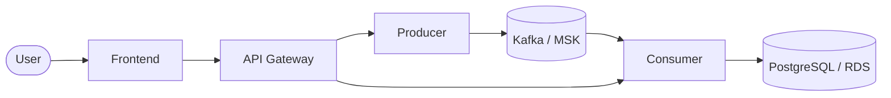

# RomanStream Pipeline

**Event-driven microservices on AWS** — a Roman numeral → Arabic number converter built to demonstrate DevOps practices: containerization, Kafka streaming, infrastructure as code, and Kubernetes deployment on EKS.

---

## Architecture



### Request flow

1. **Frontend** — user submits a Roman numeral (e.g. `XIV`).
2. **API** — orchestrates the pipeline: enqueue via producer, poll consumer for the stored result.
3. **Producer** — publishes the Roman numeral to the `roman-input` Kafka topic.
4. **Consumer** — reads from Kafka, converts Roman → Arabic, persists to PostgreSQL.
5. **PostgreSQL** — stores results in the `inputs` table (`roman`, `arabic`, `created_at`).

---

## Tech stack

| Layer | Technologies |
|-------|-------------|
| Application | Python 3.11, Flask |
| Messaging | Apache Kafka (local: Bitnami; AWS: MSK) |
| Database | PostgreSQL 15 (local: Docker; AWS: RDS) |
| Containers | Docker, Docker Compose |
| Orchestration | Amazon EKS, Kubernetes |
| Infrastructure | Terraform, AWS VPC, NAT, Security Groups |
| CI/CD | GitHub Actions |
| State backend | S3 + DynamoDB |

---

## Project structure

```
.
├── apps/
│   ├── fe/          # Web UI
│   ├── api/         # API gateway (orchestrates producer + consumer)
│   ├── producer/    # Publishes messages to Kafka
│   └── consumer/    # Consumes Kafka, writes to Postgres
├── k8s/             # Kubernetes manifests for EKS
├── scripts/         # Helper scripts for K8s secret creation and deploy
├── main.tf          # AWS infrastructure (VPC, RDS, MSK, EKS)
├── docker-compose.yaml
└── .github/workflows/terraform.yml
```

---

## Prerequisites

- Docker and Docker Compose
- Python 3.11+ (for local development)
- Terraform 1.8+
- AWS CLI (for cloud deployment)
- kubectl (for EKS deployment)

---

## Local development

### 1. Clone and configure secrets

```bash
git clone https://github.com/your-username/Kafka-Project.git
cd Kafka-Project
cp .env.example .env
# Edit .env and set POSTGRES_PASSWORD and DB_PASS to a strong password
```

### 2. Start the stack

```bash
docker compose up --build
```

### 3. Use the app

Open [http://localhost:5001](http://localhost:5001), enter a Roman numeral (e.g. `XIV`), and submit.

| Service | Port |
|---------|------|
| Frontend | 5001 |
| API | 5002 |
| Producer | 5003 |
| Consumer | 5004 |
| Kafka | 9092 |
| PostgreSQL | 5432 |

### 4. Health checks

```bash
curl http://localhost:5001/healthz   # frontend
curl http://localhost:5002/healthz   # api
curl http://localhost:5003/healthz   # producer
curl http://localhost:5004/healthz   # consumer
```

---

## AWS deployment (Terraform)

### 1. Configure credentials and variables

```bash
cp terraform.tfvars.example terraform.tfvars
# Edit terraform.tfvars and set db_password

# Or export the password:
export TF_VAR_db_password="your-secure-password"

aws configure   # or use AWS_ACCESS_KEY_ID / AWS_SECRET_ACCESS_KEY env vars
```

### 2. Initialize and apply

```bash
terraform init
terraform plan
terraform apply
```

### 3. Infrastructure provisioned

- **VPC** — 3 public + 3 private subnets across `us-east-1a/b/c`
- **NAT Gateways** — one per AZ for private subnet egress
- **RDS PostgreSQL** — private, accessible only from EKS worker nodes
- **MSK Kafka** — 3-broker cluster in private subnets
- **EKS** — Kubernetes 1.29 cluster with managed node group (2–5 `t3.medium` nodes)

### 4. Useful outputs

```bash
terraform output rds_endpoint
terraform output msk_bootstrap_brokers
terraform output eks_cluster_name
```

---

## EKS deployment (Kubernetes)

### 1. Configure kubectl

```bash
aws eks update-kubeconfig --region us-east-1 --name "$(terraform output -raw eks_cluster_name)"
```

### 2. Build and push images (if not already on Docker Hub)

```bash
docker compose build
docker compose push   # requires docker login
```

### 3. Create Kubernetes secrets from Terraform outputs

```bash
export DB_PASSWORD="your-secure-password"   # same value used in terraform.tfvars
chmod +x scripts/create-k8s-secret.sh scripts/deploy-k8s.sh
./scripts/create-k8s-secret.sh
```

### 4. Deploy all services

```bash
./scripts/deploy-k8s.sh
```

### 5. Verify and access

```bash
kubectl get pods -n romanstream
kubectl get svc fe -n romanstream
```

The frontend `LoadBalancer` service exposes port 80. Use the `EXTERNAL-IP` (or hostname on AWS) to access the app.

### Optional: ALB Ingress

If the [AWS Load Balancer Controller](https://kubernetes-sigs.github.io/aws-load-balancer-controller/) is installed on your cluster, switch the `fe` Service to `ClusterIP` and apply:

```bash
kubectl apply -f k8s/ingress.yaml
```

---

## CI/CD (GitHub Actions)

The workflow in `.github/workflows/terraform.yml` runs on every push and pull request to `main`:

1. `terraform fmt -check`
2. `terraform validate`
3. `terraform plan`
4. `terraform apply` (only on push to `main`)

### Required GitHub secrets

| Secret | Description |
|--------|-------------|
| `AWS_ACCESS_KEY_ID` | AWS credentials for Terraform |
| `AWS_SECRET_ACCESS_KEY` | AWS credentials for Terraform |
| `TF_VAR_db_password` | RDS master password (matches `terraform.tfvars`) |

---

## Database schema

The consumer creates the table automatically on startup:

```sql
CREATE TABLE IF NOT EXISTS public.inputs (
    id SERIAL PRIMARY KEY,
    roman TEXT,
    arabic INT,
    created_at TIMESTAMP DEFAULT NOW()
);
```

---

## Security notes

- **Never commit** `.env`, `terraform.tfvars`, or `k8s/secret.yaml` — they are gitignored.
- Use strong passwords and rotate credentials regularly.
- MSK is configured with `PLAINTEXT` for demo simplicity; enable TLS (`TLS` or `SASL_SSL`) for production.
- RDS is private and only reachable from EKS worker security groups.

---

## Resume highlights

**Project title:** Event-Driven Microservices Pipeline on AWS (Kafka, EKS, Terraform)

- Designed and provisioned multi-AZ AWS infrastructure with Terraform, including VPC (public/private subnets, NAT gateways), private RDS PostgreSQL, 3-broker MSK Kafka, and EKS with remote state stored in S3 and DynamoDB locking.
- Built and containerized a 4-service event-driven application (web UI, API gateway, Kafka producer, Kafka consumer) using Docker and Docker Compose, with health checks, retry logic, and Kubernetes deployments on EKS.
- Implemented GitHub Actions CI/CD for infrastructure automation with `terraform fmt`, `validate`, `plan`, and gated `apply` on the main branch.

---

## License

MIT
